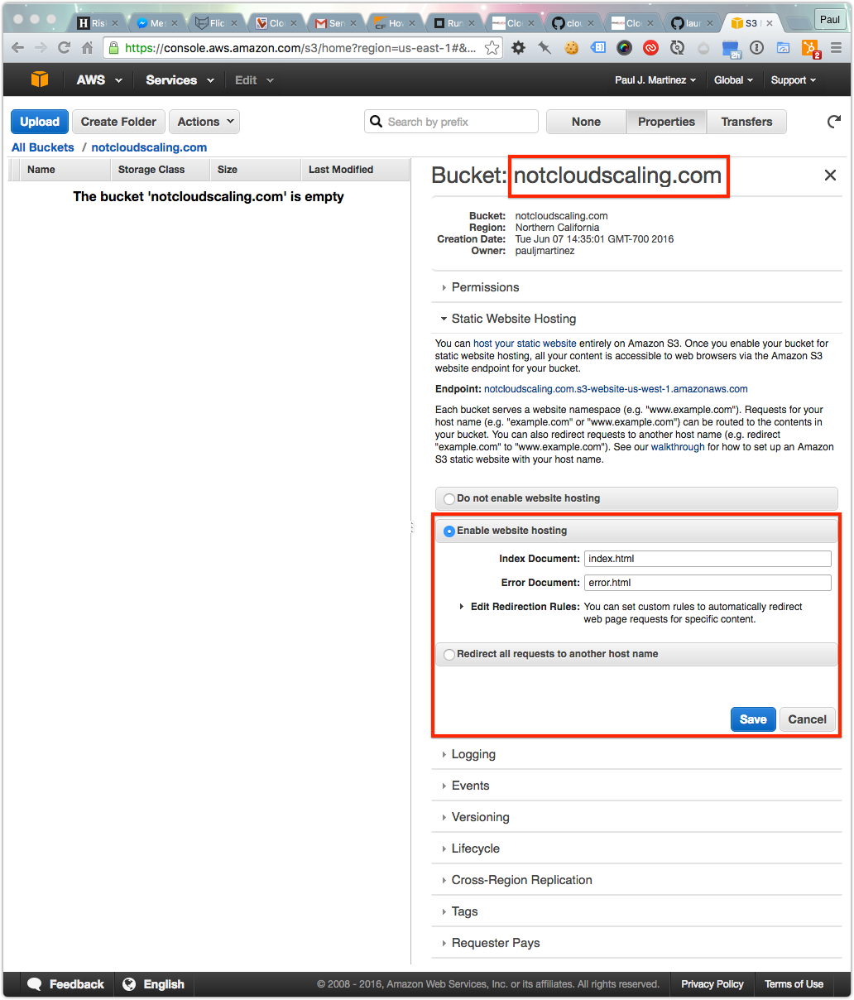
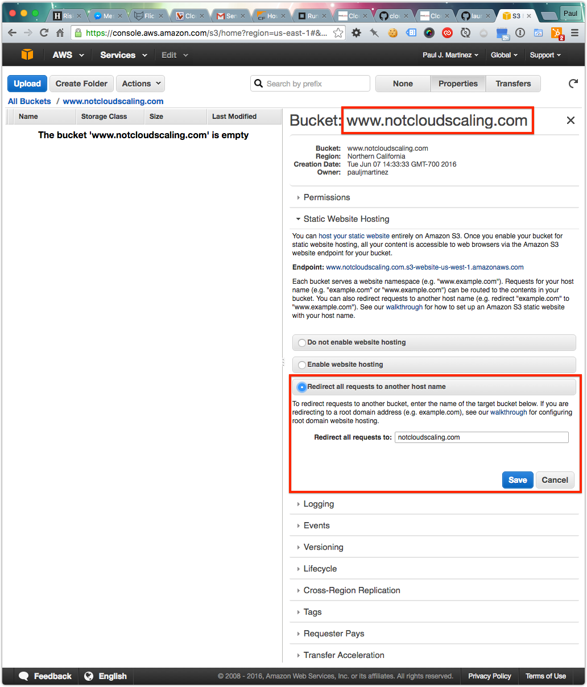

Cloudscaling - Blog
===================

This project uses [Jekyll](http://jekyllrb.com/docs/installation/). Jekyll requires [Ruby](https://www.ruby-lang.org/en/downloads/). [Sass](http://sass-lang.com) and [Ruby-oembed](https://github.com/judofyr/ruby-oembed) to preprocess and convert certain content to iframes. [s3_website](https://github.com/laurilehmijoki/s3_website) is mainly used to create redirects and push files to staging and production. [Bundler](http://bundler.io/) is a package manager that makes versioning Ruby software like Jekyll a lot easier while also managing dependencies.

Getting Started
---------------

1. Clone this repo locally.
2. Jekyll requires the Ruby language. If you have a Mac, you've most likely already got Ruby. If you open up the Terminal application, and run the command `ruby --version` you can confirm this. Your Ruby version should be at least 2.0.0. If you've got that, you're all set. Otherwise, follow [these instructions to install Ruby](https://www.ruby-lang.org/en/downloads/).
3. `cd` to the project root
4. Run `gem install bundler` to install the bundler
5. Run `bundle install` to install the build dependencies.
6. Now, run `bundle exec jekyll serve build --watch` to start jekyll and watch for file changes.
7. Open a browser `http://127.0.0.1:4000/`

Adding New Posts
----------------

### Goals

  - Simplify the new post creation process
  - Create all new posts without a category
  - Add all new blog posts to a single folder

### Process

  - Create all new posts from the `./blog/_posts/` folder
  - The filename for all new posts need to include
    + The date, in `yyyy-mm-dd-` format
    + The slug, `this-is-my-post`
    + The file extention, `.markdown`
  - The full path to a new post should look like the following
    + `./blog/_posts/2013-08-20-vote-now-fall-openstack-summit-presentations.markdown`

Deployment Configuration
------------------------
The site uses 2 configuration files. one for staging and one for production:

1. `_s3_prod_config/s3_website.yml` is used for production
2. `_s3_stage_config/s3_website.yml` is used for staging

The S3 configuration credentials are supplied with the following variables:

1. s3_id: <%= ENV['S3_ID'] %>
2. s3_secret: <%= ENV['S3_SECRET'] %>
3. s3_bucket: <%= ENV['S3_BUCKET'] %>

As these credentials are confidential, they are instantiated in variables and are not part of the repository.

These credentials should be added to the following files for production and staging respectively:

  - `./_s3_prod_config/s3_private_config.sh`
  - `./_s3_stage_config/s3_private_config.sh`

See the following files for an example:

  - `./_s3_prod_config/s3_private_config.sh.dist`
  - `./_s3_stage_config/s3_private_config.sh.dist`

Blog Deployment
---------------

The site uses s3_website to deploy files to S3.
s3_website will download a jar file the first time you run it.
The following commands will run as a dry-run, enter 'y' to deploy:

1. Run `sh _deploy/deploy.sh stage` to push to staging
2. Run `sh _deploy/deploy.sh production` to push to production

Blog Configuration
------------------

[s3_website](https://github.com/laurilehmijoki/s3_website) needs both Ruby and Java to run. (S3_website is partly written in Scala, hence the need for Java.) The site uses s3_website to deploy files.
The configuration files are stored in `_s3_prod_config` and `_s3_stage_config`. 
In order to change the S3 bucket, update `s3_website.yml` 

Jekyll Theme Notes
------------------

1. All project assets (pdf, sheets and images) reside within the jekyll assets folder `assets`
2. Plugins are under `_plugins`
3. The `_includes` folder has the different partials for the site such as:
    - head
    - header.html
    - pagination.html
    - search.html
4. The `_layouts` folder has the different layouts for the site such as:
    - a regular page - page.html
    - a single post - post.html
    - authors page - single_author.html
5. The `blog` folder has all the posts, the sub folders are use to replicate the categories from the main blog.
    - Example: cloud-computing/_posts/2015-08-11-cloud-youre-doing-it-wrong.markdown => HOST/blog/cloud-computing/cloud-youre-doing-it-wrong/

CloudFlare setup for S3
-----------------------
First you'll want to create your Amazon S3 bucket through the appropriate Amazon webpage.  Please make sure to note the full host URL assigned to the bucket you just created -- for example,  'files.example.com'.

1. Login to your CloudFlare account.
2. From the dropdown menu on the top left, select your domain.
 Select the DNS settings tab.
3. Add a CNAME record to your AWS bucket.

If your domain is "example.com" and you want to use the CNAME "files"  you'll need to make sure the S3 bucket name is "files.example.com". Amazon requires that the CNAME match the bucket name.

--Configuring CORS (Cross Origin Resource Sharing) directions from Amazon:

Configuring your bucket for CORS is easy. To get started, open the Amazon S3 Management Console, and follow these simple steps:
1. Right click on your Amazon S3 bucket and open the “Properties” pane.
2. Under the “Permissions” tab, click the “Add CORS configuration” button to add a new CORS configuration. You can then specify the websites (e.g., "mywebsite.com") that should have access to your bucket, and the specific HTTP request methods (e.g., “GET”) you wish to allow.
3. Click Save.

CloudFlare supports CORS and operates in the following way:

1. The CloudFlare CDN identifies cache items based on the Host Header + Origin Header +  Path and Query, which supports different objects using the same host header, but different origin headers
2. CloudFlare passes Access-Control-Allow-Origin header through unaltered from the origin server to the browser

Amazon S3 Setup to Support WWW and Non-WWW
------------------------------------------

We have two S3 buckets on AWS, but the site content lives in just the canonical buckets. The other bucket (non-canonical) redirects all requests to the canonical. 

Use these settings for the canonical domain.

Use these settings for the non-canonical domain.

Contribution Process
--------------------

This site uses [GitHub Flow](https://guides.github.com/introduction/flow/) workflow for contributions.

Read more about [GitHub Flow](https://guides.github.com/introduction/flow/) here.

Here is a high-level overview of the process:

  1. Fork the repository
  2. Create a branch using the `git checkout -b $BRANCH_NAME`. Replace `$BRANCH_NAME` with your branch name
  3. Add commits to your branch using the `git add .` and `git commit -m ""` commands. Push your commits to your branch with `git push origin $BRANCH_NAME`
  4. Open a Pull Request using the https://help.github.com/articles/using-pull-requests/GitHub UI.
  5. Discuss and review your code in the [GitHub UI](https://help.github.com/articles/using-pull-requests/)
  6. Once your Pull Request has been reviewed and approved, one of the site owners will merge and deploy your Pull Request
